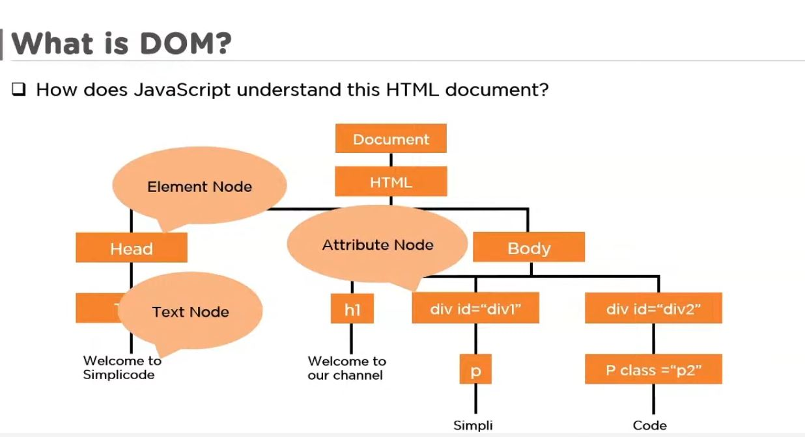
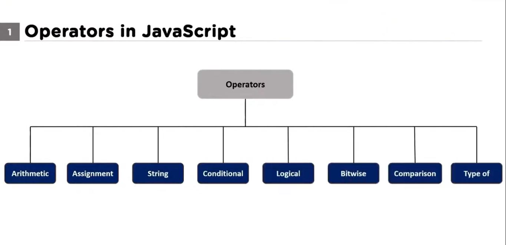

# I'm Learning JavaScript
LOL , Js was built in a week, that explains why its so tra-


###### DOM - Document Object Model

DOM is an api to communicate with HTML documents, Nodes are in Doms for the same reason (God i'm saying trash already)

3 types of Nodes as stated in the Diagram

### How to declare a variable
```js script
var name = "Ilesanmi OLuwasijibomi"; //Stores string
var age; //Is an empty string so it will be undefined till it is given a value

```
Dont forget the freaking semi-colon, this isnt python. 
Using var is the traditional way of declaring variables,
but in more updated versions (I think) e.g ES6 using let and const can also be used
```js script
let height = "sha fucking tall"
const pi = 4.19 
```
###### Why use let and const
```let``` is limited to the block which it is declared i.e its not a universal variable, do let should be used inside blocks
```const``` is universal   

### Types of Datatypes
```js script
var age = 18; // Integer
var name = 'Blurry'; // string 
var virgin = true; // Bool
var babe; // Undefined
```
### Operators


#### Arithmetic
Addition (+)
SUbtraction (-)
Division (/)
Multiplication (*)
Increment (++)
Decrement (--)

#### Assignment


#### Logical


#### Comparison


### Control Statements
if ... else statements
```js script
var x = 10
if (x>10){
    documents.write('X is greter than 10')
}else if(x == 10){
    document.write('X is equals to  10')
}else{
    document.write('X is less than 10')
}
```

### Functions in Javascript
Functio uses the function keyword e.g
```js script
function sum(x,y){
    return x+y
}

```
### Scope of Variables in Javascript
2 types of variables:
    Local variables
    Global variables
var keyword has a limited scope inside and outside a function.
siji pls just never use let, just use var and const

### Strings in Javascript
I just recalled escape sequence and concantenation in js

### Arrays in Javascript
```js script
var car = ['Honda' , 'Kia' , 'Ford']
document.write('<h1>'+car+'</h1>')
```
index also starts from 0

```js script
var car = ['Honda' , 'Kia' , 'Ford']
for(var i=0;i<3;i++){
    document.write(document.write('<h1>'+car[i]+'</h1>'))
}
```
Another way to call your Array
```js script
var fruits = new Array('Mango' , 'Banana' , 'Apple' , 'Grape')
for(var i = 0 ; i < fruits.length() ; i++){
    document.write('<h1>'+fruits[i]+'</h1>')
}
```
### Objects in Javascript
```js sccript
var car = {
    manufacture : "Honda",
    color : "Red",
    allprintsha : function()
    {
        document.write('Hello World')
    }
}
```
Better way
```js sccript
function cars : (brand , color , model){
    this.brand = brand
    this.color = color
    this.model = model
    this.drive : function(self , brand , model ){
        document.write('I drive a '+this.brand+' colored'+ this.color)
    }
}
```

### Classes in Javascript

```js script
class Student{
    constructor(name , age , roll){
        this.name = name
        this.age = age
        this.roll = roll
    }

    org(){
        return(this.name+' works at Blur studios')
    }
    dob(){
        return(this.name+' is '+this.age+' years old')
    }
}
```
inheritance
A new class will inherit from the Student class above
```js script
class Student2 extends Student{
    constructor(name, age , roll , language , department){
        super(name,age,roll)
        this.language = language
        this.department = department
    }
}
```
static methods dont need a class instance to use

### GettingElementsbyTagname in Javascript
```js script
var x = document.getElementsByTagName('div')
```
### GettingElementsbyClass in Javascript
```js script
var x = document.getElementsByClassName('div')
```
### GettingElementsbyId in Javascript
```js script
var x = document.getElementsById('div')
```
### Arrow Functions in Javascript
Arrow functions are best for one line functions
```js script
// Normal syntax
function func1(a,b){
    return a+b
}
func1(5 , 10) // Ans: 20
// Arrow Functions
var arr1 = (a , b) => {
    return a + b
}
arr1(5 , 10) //Ans:20
// Arrow FUnctions
var arr2 = () => console.log('Arrow functions are wild')
arr2()
```
### Anonymous FUnctions
Anonymous functions are functions without a name
```js script
setTimeout(function(){
    alert('This is an Anonymous function, it has no name')
} , 2000)
```
### Timing Functions in Javascript
1. setTimeout methon
```js script
    var message = () => alert('Bitch, shut the fuck up!')

    function fun1(){
        setTimeout(message , 2000)
    }
```
```js script
//sets a specofoed time before a specified function can run
setTimeout(function , time)

//Stops an alredy set time for a function
id = setTimeout(message , 2000)
clearTimeout(id)

//Repetitively calls a specified function after a specified time 
setInterval(function , time)
```

### Async Await  in Javascript


### Error Handeling  in Javascript
```js script
var namess = (names) =>{
    console.log('my name is '+ namesd);
};
try{
    namess('jake');
     
} catch (error) {
    console.log(error + ' is shit')
}
```
error.name
error.message


### Regex  in Javascript
```js script
var regex = /hELlo/ig
var str1 = 'WHatsup guys, say Hello to the channel'

//Displays thespecified string(s) in an array
var output = regex.exec(str1)
console.log(output)

//Works with the g modifier to identify more that one match with the pattern structure
var output = regex.exec(str1)
console.log(output)

var output = regex.test(str1)
console.log(output)

var output = str1.match(regex)
console.log(output)
```
Methods in regex
exec(): outputs the matches in an array
test(): returns a bool for whether theres a match or not
match(): returns an array too, but the syntax is opposite the upper two, there you pass the regular expression as a parameter.

modifiers
are used for better string pattern matching
i: its put after the second slash and is used to ignore the case sensitivity in regex
test wont work

g: its put after the second slash and is used to allow regex recognize more than  1 match of the same pattern, must be called the second time

### Metacharacters  in Javascript


